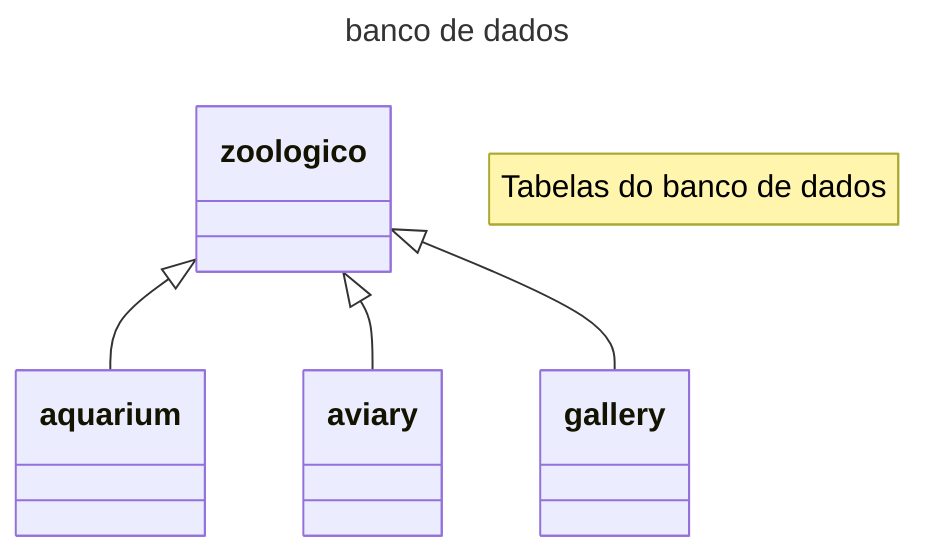
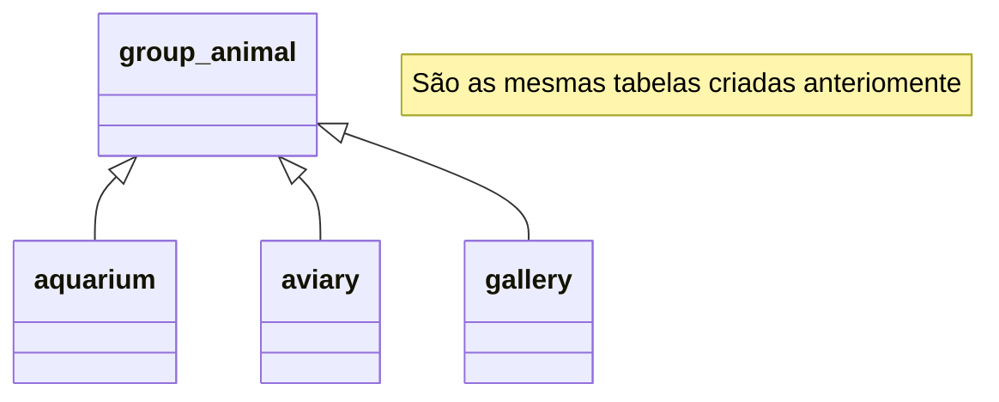
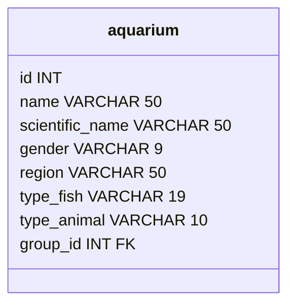
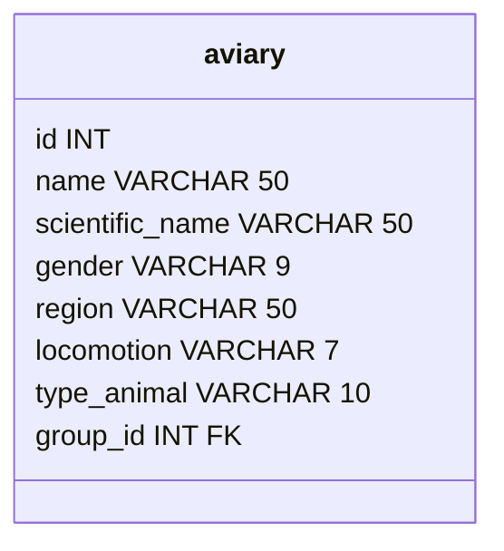
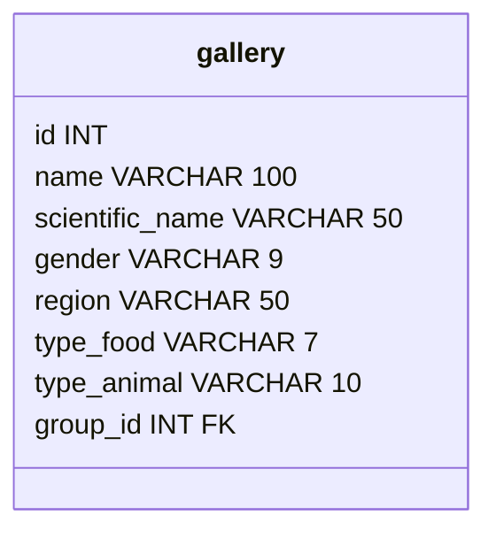
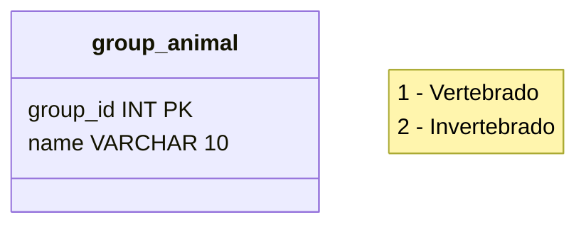

# Banco de dados - Zoologico

- O zoologico é a base de dados geral
- O zoologico é dividido em áreas
- As areas serão: aquario, aviario e galeria
- Os animais serão divididos por vertebrados e invertabrados
- Os vertebrados serão divididos por classes
- As classes dos animais vertebrados serão: peixe, passaro, mamiferos, repteis e anfibios
- Animais invertebrados não terão classes

## Inicio do banco de dados

É criado o banco de dados com nome zoologico, junto com 3 tabelas iniciais que representam as áreas dos zoologico que são aonde estão os animais (aquarium, aviary, gallery) 

## Tabela de grupo e suas relações

É criado a tabela que guardará a informação de qual grupo um determinado animal pertence, terá uma conexão de chave-estrangeira (FK) nessa tabela para as outras 3 criadas anteriomente.

## Tabelas do banco de dados - Áreas

São criadas as tabelas das áreas com seus campos aonde serão inseridos as informações dos animais de cada área especifica.
No geral são: id, nome, nome cientifico, gênero, região originaria, grupo animal.

Execeções:
- Aquarium: tipo de peixe sendo osseo ou cartilaginoso
- Aviary: tipo de locomoção como voar e andar
- Gallery: tipo de alimentação como carnivoro, herbivoro ou onivero.

## Tabelas do banco de dados - Grupo de animais

É criada a tabela que armazena os tipo de grupo que o animal pertence (vertebrado ou invertebrado).

## Exemplo de registro

Aquarium:
- 1, 'Tubarão Martelo', 'Sphyrna spp.', 'Macho', 'Oceano Pacífico', 'Cartilaginoso', 'Peixe', 1
- 2, 'Salmão do Atlântico', 'Salmo salar', 'Fêmea', 'Oceano Atlântico', 'Ósseo', 'Peixe', 1

Aviary: 
- 1, 'Canário', 'Serinus canaria', 'Macho', 'América do Sul', 'Voar', 'Passaro', 1
- 2, 'Pinguim Imperador', 'Aptenodytes forsteri', 'Macho', 'Antártica', 'Andar', 'Passaro', 1

Gallery: 
- 1, 'Leão', 'Panthera leo', 'Macho', 'África', 'Carnívoro', 'Mamífero', 1

- 2, 'Sapo', 'Anura spp.', 'Fêmea', 'América do Sul', 'Herbivoro', 'Anfíbio', 1

- 3, 'Cobra', 'Serpentes spp.', 'Fêmea', 'Ásia', 'Carnívoro', 'Réptil', 1

- 4, 'Aranha de Jardim', 'Araneae spp.', 'Macho', 'Mundo todo', 'Carnívoro', 2