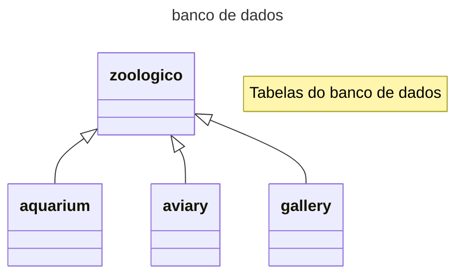
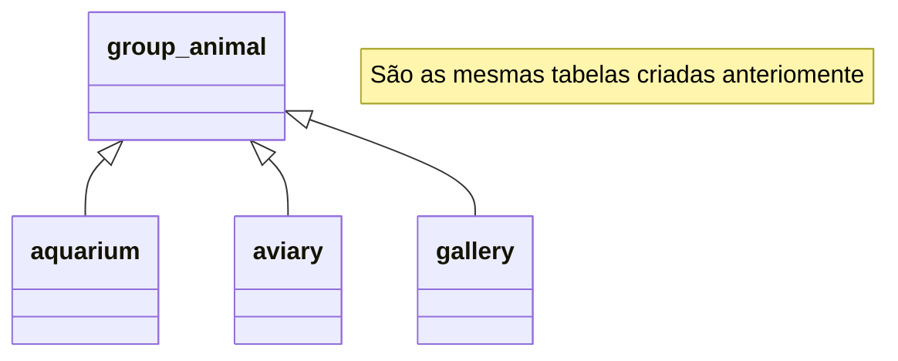
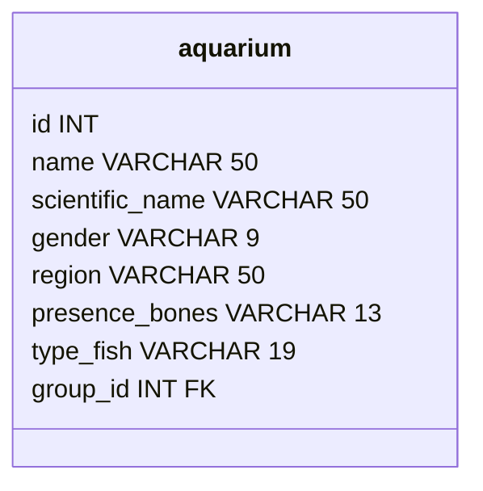
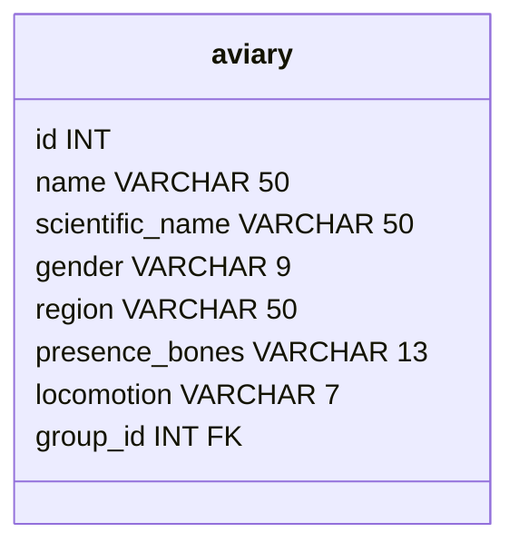
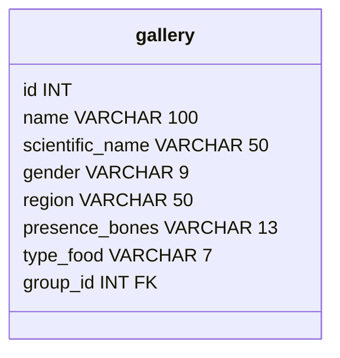
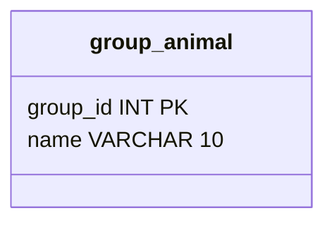

# Banco de dados - Zoologico

- O zoologico é a base de dados geral
- O zoologico é dividido em áreas
- As areas serão: aquario, aviario e galeria
- Os animais serão divididos por vertebrados e invertabrados
- Os vertebrados serão divididos por classes
- As classes dos animais vertebrados serão: peixe, passaro, mamiferos, repteis e anfibios
- Animais invertebrados não terão classes

## Inicio do banco de dados

---
   Tabela de grupo e suas relações
---

---
   Tabelas do banco de dados - Áreas
---

---
   Tabelas do banco de dados - Grupo de animais
---

